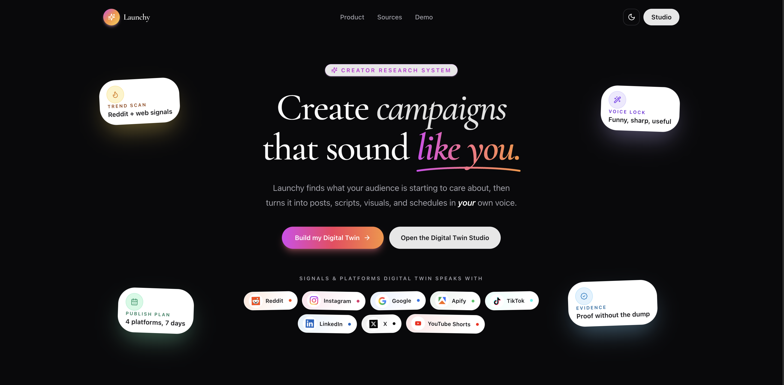
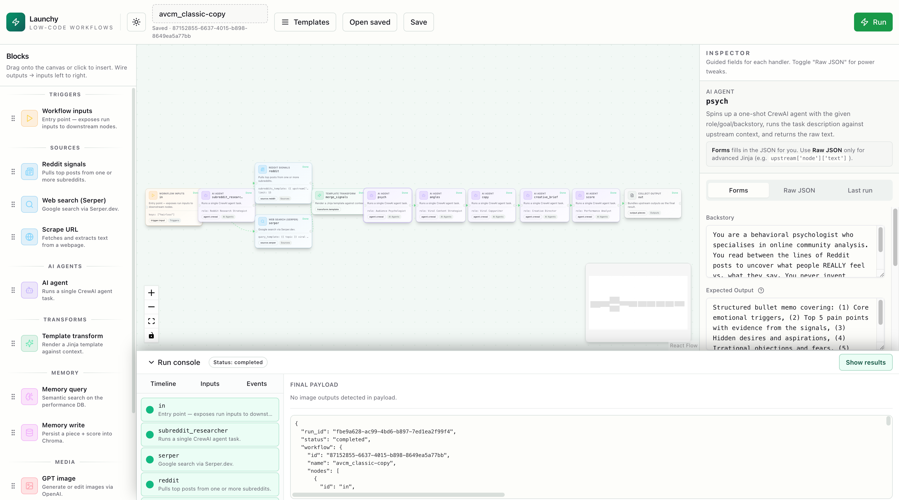
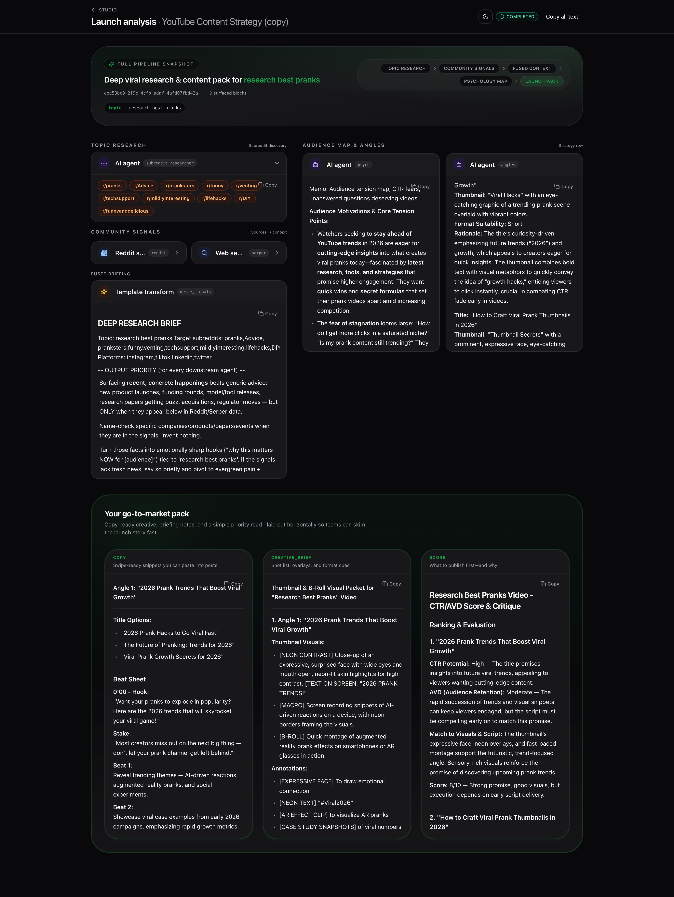
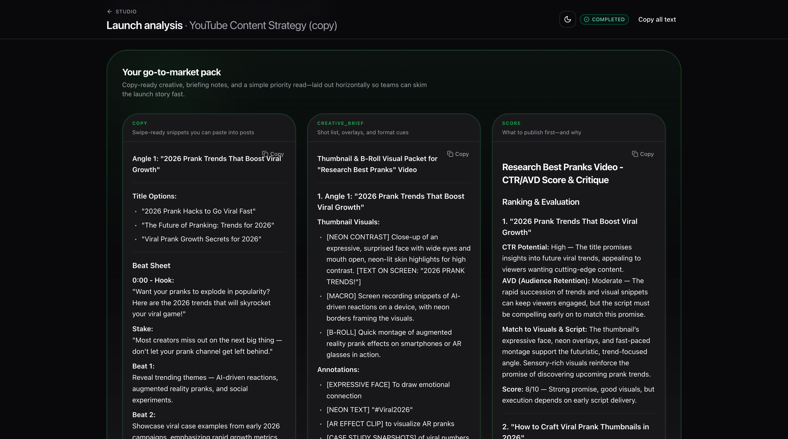
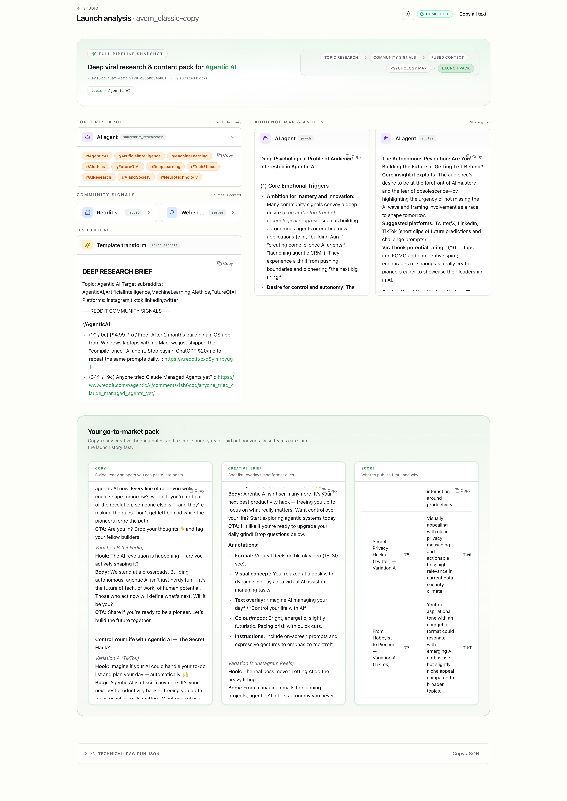

# Launchy

**Launchy** helps you turn a niche or product idea into **scroll-stopping posts and creatives** — with real-world context from social signals (especially **Reddit**), structured AI drafts, scoring, optional **hero images**, and a path to refine what worked over time.



Technical stack in one breath: Python **3.11**, **`uv`** for deps, **CrewAI** agents, **FastAPI**, **OpenAI** (LLM + embeddings), **Leonardo FLUX Dev** (workflow image generation), **ChromaDB** for long-run memory (`text-embedding-3-small`). **Instagram** ingestion is opt-in via Apify (`--instagram` / RunConfig flag).

The CLI binary is still **`avcm`** — same codebase, same orchestration (**`PipelineController`**) whether you ship the classic API routes or workflow routes.

### Product landing

The marketing home (**`/`**) lives in [`web/src/pages/LandingPage.tsx`](web/src/pages/LandingPage.tsx). It frames the creator path as a **Digital Twin**: trend scan, voice lock, publish plan, and evidence cards; primary CTA to **`/campaigns`**, secondary to **`/studio`**; integrations strip for signals and platforms.


### Workflow Studio & launch output

**Workflow Studio** — canvas, blocks, inspector, run console  



**Launch analysis**



**Go-to-market pack** — copy, creative brief, score  



**Full launch output**



---

## Prerequisites

- Python **3.11**
- [`uv`](https://docs.astral.sh/uv/) (`curl -LsSf https://astral.sh/uv/install.sh | sh` or package manager)
- API keys in `.env` (copy from `.env.example`):
  - **`OPENAI_API_KEY`** — agents + `text-embedding-3-small` embeddings
  - **`LEONARDO_API_KEY`** — workflow image blocks (`media.gemini_image` → Leonardo **FLUX Dev** via `/generations`)
  - **`SERPER_API_KEY`** — Google-style search snippets for Trend Hunter (**`SerperDevTool`**)

Optional:

- **`CHROMA_PERSIST_DIR`** — overrides `./memory/performance_db`
- **`APIFY_API_TOKEN`** + `uv sync --extra instagram` — enables Instagram hashtag scraping via Apify (`apify/instagram-hashtag-scraper` by default)

---

## Setup

```bash
uv sync
cp .env.example .env   # fill keys
```

---

## CLI

Relevance grows from your **`--niche` copy** plus Serper queries derived from it (see `agents/crew_adapter.py` `_serper_query_hints`). Reddit defaults are intentionally broad discovery; pass **`--subreddits a,b,c`** when you want focused communities — there’s no baked-in vertical taxonomy in code.

```bash
# Pipeline run (writes outputs/<run_id>.json)
uv run avcm run --niche "AI SaaS"

# Example options — defaults follow RunConfig (e.g. platforms, angles, variants)
uv run avcm run --niche "AI SaaS" --subreddits "SaaS,Entrepreneur" --platforms "twitter,linkedin"

# Instagram scraping via Apify hashtag actor (requires APIFY_API_TOKEN and instagram extra)
uv run avcm run --niche "fitness" --instagram

# After publishing: ingest CSV → Chroma deltas (columns like content_id, likes, shares, comments)
uv run avcm memory ingest path/to/results.csv

# Same engine as CLI, over HTTP + workflow routes
uv run avcm serve --port 8000
```

Classic runs accept an optional **`--voice-profile-id`** UUID from Train your Twin (saved JSON under `voice/profiles/`):

```bash
uv run avcm run --niche "AI SaaS" --voice-profile-id "<profile-uuid>"
```

In **`web`** (Vite dev or static `/app`): **`/`** Workflow Studio · **`/voice`** train voice · **`/twin`** Digital Twin chat (SSE + tools).

---

## HTTP API

- **`POST /runs/`** — body matches **`RunConfig`** (`niche`, optional `platforms`, `angles`, variations, `include_instagram`, `voice_profile_id`, …)
- **`GET /runs/{run_id}`** — read **`outputs/{run_id}.json`** written by each run (filesystem-backed)
- **`GET /runs/{run_id}/pieces`** — content pieces JSON only
- **`POST /memory/ingest`** — multipart CSV upload (same shape as CLI)
- **`GET /health`**
- **Voice profiles**
  - **`GET|POST /voice/profiles`** — list / create trainer (samples: `text`, `url`, `reddit_user`)
  - **`GET|PUT|PATCH|DELETE /voice/profiles/{id}`**
- **Digital Twin chat**
  - **`POST /twin/sessions`**, **`GET /twin/sessions`**, **`GET /twin/sessions/{id}`**, **`PATCH`** voice on session
  - **`POST /twin/sessions/{id}/messages`** — SSE stream (`Accept: text/event-stream`)
  - **`GET /workflows/node-types`** — JSON Schema per node kind (`trigger.input`, `agent.crewai`, `media.gemini_image`, …)
  - **`GET /workflows`**, **`POST /workflows`**, **`GET|PUT|DELETE /workflows/{id}`** — saved graphs in **`workflows/stored/`**
  - **`GET /workflows/templates`**, **`GET /workflows/templates/{id}`**, **`POST /workflows/clone-template`**
  - **`POST /workflow-runs`** — `{ "workflow_id": "<id>", "inputs": { … } }` or inline `"workflow"`; artifacts under **`outputs/<run_id>/`** (`workflow_run.json`, **`nodes/`**, **`events.jsonl`**)
  - **`GET /workflow-runs/{run_id}`** — snapshot of run metadata + outputs
  - **WebSocket** **`/workflow-runs/{run_id}/ws`** — streams parsed events until **completed** / **failed**, then a **`sync`** message
  - **`GET /artifacts/{path}`** — files under **`outputs/`** (e.g. **`{run_id}/images/...`** for image-node PNGs)

**Frontend:** `cd web && npm run build`, then **`http://127.0.0.1:8000/app/`** with **`uv run avcm serve`** (Vite **`base`/static mount is `/app/`). Local UI dev: **`cd web && npm run dev`** (proxies workflows and artifacts to API port 8000).

Example pipeline call:

```bash
curl -s -X POST http://127.0.0.1:8000/runs/ \
  -H "Content-Type: application/json" \
  -d '{"niche":"AI SaaS"}' | jq .
```

---

## Success metrics & telemetry

- Structured JSON logs from logger **`avcm`** (`core/logging.py`) — **`run_started`** / **`run_finished`** (`run_id`, `success`, `pieces`).
- Each successful **`avcm run`** writes **`outputs/<run_id>.json`** for dashboards or QA.
- After you collect engagement, **`memory ingest`** updates **`delta`** vs stored **`predicted_score`** metadata in Chroma.

---

## Tests & lint

```bash
uv run pytest
uv run ruff check core agents tools memory api cli workflow tests evals
```

---

## Contributing & internals

Contributor notes and MCP hints live in **[AGENTS.md](AGENTS.md)**. Cursor rules: **[`.cursor/rules/`](.cursor/rules/)**. Project agent skills (marketing surfaces): **[`.cursor/skills/`](.cursor/skills/)**.
